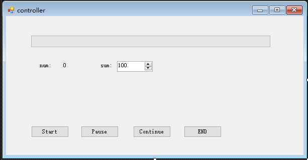
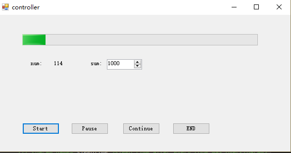

# 一个用多线程控制任务工作状态的组件

## 问题描述

在使用迅雷时，会有关于下载的开始、暂停、继续、删除等任务状态控制操作。我们在实际工作中，我们也会遇到类似与这种需求。

  

通常情况下，我们并不会有那么多的任务，直接在任务循环或不同处理阶段放置互斥资源，然后在按钮摁下的过程中竞争这个互斥资源的控制权，从而达到目的。这个方法确实可行。但如果像这样的页面比较多，或者多个地方都需要类似的功能，那么就要在每个地方都重新写一般逻辑。显然大家都不想写重复的代码，或者在完成核心业务时还有这方面的困扰。

## 组件功能

- 业务部分和控制业务状态的这部分分离；
  在实际工作中，变化的主要是业务部分。

- 为处理业务、控制状态、任务完成、任务状态提示等提供接口；

- 线程安全

## 组件使用示例

### 示例功能介绍

  我们在winform中设计一个如下图的页面。

  

  我们的任务是：

- 从0数到sum，即每100ms递增一次；

- 在计数的过程中要求num显示当前数到哪个数；

- 最上面的进度条显示这个任务的完成百分比；

- 按下start按钮计数开始，在计数的过程中重复按下时要么没反应，要么提示已经开始；

- 按下pause按钮，只有在计数的状态才有效；

- 按下continue按钮，原来已经被暂停的状态释放，继续计数；

- 按下end按钮，整个计数任务结束。

### 各按钮处理函数

为完成上述功能，我们只需要先添加组件 yWorkThreadHandle 的实例对象TemplateThreadPrint，然后在按钮的点击事件中各自添加下面的实例代码（只要有类似的功能，这些代码都不需要修改）：

- Start 按钮

      private void btnStart_Click(object sender, EventArgs e)
      {
          if (TemplateThreadPrint == null)
          {
              TemplateThreadPrint = new yWorkThreadHandle(PrintMethodDelegate,
                  CheckMethod, lastThingToDo, (int)nudSum.Value, 1, 100, RtbShowMessage);
          }
          if (!TemplateThreadPrint.Work_Thread())
          {
              if (true)
              {
                  TemplateThreadPrint = new yWorkThreadHandle(PrintMethodDelegate,
                      CheckMethod, lastThingToDo, (int)nudSum.Value, 1, 100, RtbShowMessage);
                  TemplateThreadPrint.Work_Thread();
              }
          }
      }

- Pause 按钮

        private void btnPause_Click(object sender, EventArgs e)
        {
            if (TemplateThreadPrint != null)
            {
                TemplateThreadPrint.Pauser_Thread();
            }

        }

- Continue 按钮

      private void btnContinue_Click(object sender, EventArgs e)
        {
            if (TemplateThreadPrint != null)
            {
                TemplateThreadPrint.Continue_Thread();
            }

        }

- END 按钮

      private void btnEnd_Click(object sender, EventArgs e)
        {
            if (TemplateThreadPrint != null)
            {
                TemplateThreadPrint.Stop_Thread();
            }

            MessageBox.Show("exiting now !!");
            // this.Close();

        }

- 另外，在开始按钮下的组件初始化的各参数说明如下，也可以直接看源码

        /// 

        /// Constructor for work thread control
        /// 

        /// <param name="worktMethod">describe print method in constructor parameter, and this delegate's parameter represent working count index</param>
        /// <param name="checkMethod">check method, first parameter is work index, second is the result of checking thread</param>
        /// <param name="workCount">work count</param>
        /// <param name="workCountPer">per set</param>
        /// <param name="sleepTime">sleep time after every code was running over</param>
        /// <param name="rtb">container for show work threads thread states</param>
        /// <param name="alertMessage">describe alert message method, like messagebox's show method.</param>
        public yWorkThreadHandle(Action<int> workMethod,
                                Func<int, bool> checkMethod,
                                Action<int> doLastThing,
                                int workCount,
                                int workCountPer,
                                int sleepTime,
                                System.Windows.Forms.RichTextBox rtb = null,
                                Func<string, System.Windows.Forms.DialogResult> alertMessage = null)

    workMethod是一个Action<int>类型的委托，即完成这样的业务的函数；

    CheckMethod是一个Func<int, bool>类型的委托，在完成参数为i的业务下返回核对的结果；

    doLastThing是一个Action<int>类型的委托，在处理完所有业务后的断后函数；

    完成这几个接口，即可完成需求功能。

    

## 组件实现

本组件的原型是滑动窗口算法，只不过窗口大小恒为1.至于滑动窗口算法，希望能自行查资料。

组件中有工作者线程和休眠线程来模拟发送窗口和接收窗口。为了控制工作者线程，我们并没有使用线程提供的语言级方法，而是添加了一个线程优于前两者的暂停线程。

- 工作者线程
  主要调用业务处理的方法WorkAction(StateAndSignal.WorkIndex)和切换到休眠线程，并进行线程状态判断处理。
      private void workThreadFunc()
        {
            while (true)
            {
                StateAndSignal.SendWorkOrSleep.WaitOne();    //==================work, sleep, pause threads share

                if (StateAndSignal.SwitchState == eWorkThreadSwitch.TOWORKTHREAD)//保证在工作线程和睡眠线程之间切换
                {
                    WriteMessageToRichTextBox("======work thread");
                    StateAndSignal.SwitchState = eWorkThreadSwitch.TOSLEEPTHREAD;  //switch to sleeping thread after semaphore released
                    if (StateAndSignal.WorkStatus == eWorkState.ABORTED)
                    {
                        StateAndSignal.SendWorkOrSleep.Release();
                        break;
                    }

                    WorkAction(StateAndSignal.WorkIndex);
                    StateAndSignal.WorkIndex++;

                    if (StateAndSignal.WorkIndex == WorkNum + 1)
                    {
                        StateAndSignal.SendWorkOrSleep.Release();
                        break;
                    }
                    //WriteMessageToRichTextBox();
                }
                StateAndSignal.SendWorkOrSleep.Release();    //===================
            }
            WriteMessageToRichTextBox("======work线程结束......");
        }

- 休眠线程
  类似于接收接口，用来检测工作结果并进行相关处理
        private void SleepThreadFunc()
        {
            while (true)
            {
                StateAndSignal.SendWorkOrSleep.WaitOne();  //======================
                if (StateAndSignal.SwitchState == eWorkThreadSwitch.TOSLEEPTHREAD)
                {
                    WriteMessageToRichTextBox("======sleep thread");
                    if (StateAndSignal.WorkStatus == eWorkState.ABORTED)
                    {
                        StateAndSignal.SwitchState = eWorkThreadSwitch.ENDED;
                        StateAndSignal.SendWorkOrSleep.Release();
                        break;
                    }
                    StateAndSignal.SwitchState = eWorkThreadSwitch.TOWORKTHREAD;
                    int index = StateAndSignal.WorkIndex;
                    //checkmethods-----------------------------
                    if (CheckMethod(--index)/*||temp==1*/)
                    {
                        WriteMessageToRichTextBox("Checked........");
                        Thread.Sleep(SleepTime * (WorkCountPer));
                        //temp = 0;
                    }
                    else
                    {
                        WriteMessageToRichTextBox("work出错!!!!!!!!");
                        //temp = 1;
                        if (DialogResult.No == MessageBox.Show("继续work还是重新执行上一套？\r\n点击确认继续work。", "询问", MessageBoxButtons.OKCancel, MessageBoxIcon.Question))
                        {
                            StateAndSignal.WorkIndex = index;
                        }
                        Thread.Sleep(500);
                        Pauser_Thread();
                        Thread.Sleep(500);
                    }
                    if (StateAndSignal.WorkIndex == WorkNum + 1)
                    {
                        StateAndSignal.SwitchState = eWorkThreadSwitch.ENDED;
                        StateAndSignal.WorkStatus = eWorkState.ABORTED;
                        StateAndSignal.SendWorkOrSleep.Release();
                        break;
                    }
                    WriteMessageToRichTextBox();
                }

                StateAndSignal.SendWorkOrSleep.Release();  //=======================
            }
            if (LastThingToDo != null)
            {
                LastThingToDo(StateAndSignal.WorkIndex - 1);
            }
            WriteMessageToRichTextBox("======睡眠线程结束........");
        }

- 暂停线程
  暂停线程优于优先级高于工作线程和休眠线程，所以能立刻抢占其两者的互斥资源，导致两者进入阻塞态。而且进入循环，等待继续线程来更改其判断状态，退出循环，释放工作线程和休眠线程竞争的资源。

      private void PauseFunc()
        {
            if (StateAndSignal.WorkIndex == WorkNum)
            {
                return;
            }

            if (StateAndSignal.WorkStatus == eWorkState.WORKING)
            {
                StateAndSignal.SendWorkOrSleep.WaitOne();
                StateAndSignal.WorkStatus = eWorkState.PAUSED;
                StateAndSignal.SwitchState = eWorkThreadSwitch.TOWORKTHREAD;
                WriteMessageToRichTextBox("======pausing thread");
                WriteMessageToRichTextBox("按继续按钮继续work..........");
                while (true)
                {
                    StateAndSignal.SendPauseOrContinue.WaitOne();   //====================
                    if (StateAndSignal.WorkStatus == eWorkState.ABORTED)
                    {
                        WriteMessageToRichTextBox("======暂停线程结束........");
                        StateAndSignal.SendPauseOrContinue.Release();
                        StateAndSignal.SendWorkOrSleep.Release();
                        break;
                    }
                    else if (StateAndSignal.WorkStatus == eWorkState.CONTINUED)
                    {
                        StateAndSignal.WorkStatus = eWorkState.WORKING;
                        WriteMessageToRichTextBox("======暂停线程继续work........");
                        StateAndSignal.SendPauseOrContinue.Release();
                        StateAndSignal.SendWorkOrSleep.Release();
                        break;
                    }
                    Thread.Sleep(200);
                    StateAndSignal.SendPauseOrContinue.Release();   //=====================
                }
            }
        }

- 继续线程
  这个最简单，只要设置其线程优先级和暂停线程一样，然后等待两者间竞争资源的获取，就可以解放暂停线程，使工作者线程和休眠正常进行交替工作。

      private void ContinueFunc()
        {
            if (StateAndSignal.WorkStatus == eWorkState.PAUSED)
            {
                StateAndSignal.SendPauseOrContinue.WaitOne();   //====================
                StateAndSignal.WorkStatus = eWorkState.CONTINUED;
                WriteMessageToRichTextBox("======continue thread");
                Thread.Sleep(200);
                WriteMessageToRichTextBox("---------------------------返回暂停线程........");
                StateAndSignal.SendPauseOrContinue.Release();   //====================
            }
        }

- 终止线程
  该线程优先级最高，不管现场是什么状态，直接设置状态结束。其他线程在循环时接收到这个消息后，进入结束的处理流程。

      private void StopFunc()
        {
            if (StateAndSignal.WorkStatus == eWorkState.PAUSED)
            {
                StateAndSignal.SendPauseOrContinue.WaitOne();   //===============
                WriteMessageToRichTextBox("======stop thread");
                WriteMessageToRichTextBox("OVER!!!!!!........");
                WriteMessageToRichTextBox("---------------------------终止线程结束........");
                StateAndSignal.WorkStatus = eWorkState.ABORTED;
                //Thread.Sleep(200);
                StateAndSignal.SendPauseOrContinue.Release();   //===============
            }
            else if (StateAndSignal.WorkStatus == eWorkState.WORKING)
            {
                StateAndSignal.SendWorkOrSleep.WaitOne();
                StateAndSignal.SendPauseOrContinue.WaitOne();   //===============
                WriteMessageToRichTextBox("OVER!!!!!!........");
                WriteMessageToRichTextBox("----------------------------终止线程结束........");
                //Thread.Sleep(200);
                StateAndSignal.SwitchState = eWorkThreadSwitch.TOWORKTHREAD;
                StateAndSignal.WorkStatus = eWorkState.ABORTED;
                StateAndSignal.SendPauseOrContinue.Release();   //===============
                StateAndSignal.SendWorkOrSleep.Release();

            }
        }

- 工作状态
  各个线程会对应不同的状态，并保存在组件的成员变量中，并在访问过程中使用互斥变量的获取和释放进行访问，确保线程安全。其结构可以参与源码，里面也有注释。

      internal struct WorkStateAndSignal
      {
          /// 

          /// work count interval
          /// 

          public int WorkIndex;
          /// 

          /// switch work state between working thread and sleeping thread
          /// 

          public Semaphore SendWorkOrSleep;
          /// 

          /// switch work thread to pause, continue or stop
          /// 

          public Semaphore SendPauseOrContinue;
          /// 

          /// all work thread state
          /// 

          public eWorkState WorkStatus;
          /// 

          /// working thread and sleeping thread states
          /// 

          public eWorkThreadSwitch SwitchState;
      }

## 后记

该组件已经在实际生产中使用。如果对此组件有兴趣，也可以将这个组件单独封装到一个控件中，然后按要求把各个接口暴露出来，也可以节省很多时间和代码量。

## 联系我

  714696209@qq.com | YxjYxj1907@outlook.com
